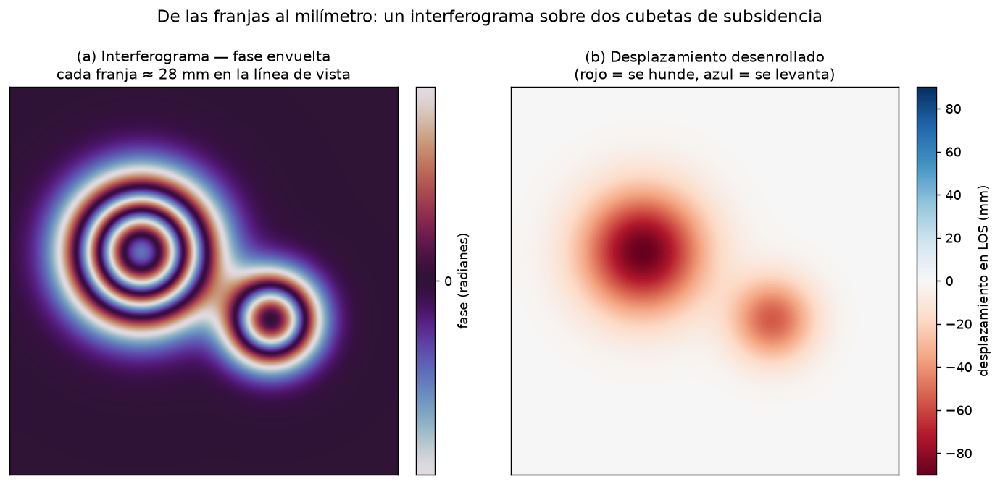

# Cómo funciona el InSAR (interferometría radar)

El **InSAR** es la técnica detrás de dos de los [casos](casos.md) de esta guía: mide **cuánto se
mueve el suelo** —de milímetros a centímetros— **desde el espacio**, sobre áreas enormes y con datos
gratuitos. Es la herramienta de referencia para subsidencia, volcanes, deslizamientos y terremotos.
Acá va, sin fórmulas, qué es, cómo funciona y —sobre todo— **qué puede y qué no**.

## La idea en una frase

> Un radar mira el mismo lugar **dos veces** desde casi la misma órbita. Si el suelo se movió entre
> las dos pasadas, la onda recorrió un camino un poco distinto, y ese **desfasaje** se mide con
> precisión de milímetros.

A diferencia de una cámara (que mide *brillo*), el radar mide también la **fase** de la onda: en qué
punto de su ciclo vuelve el eco. Comparar la fase de dos fechas es el corazón del método.

## Cómo funciona, paso a paso

1. **Radar activo (SAR).** El satélite emite microondas y mide el eco: amplitud **y fase**. Como pone
   su propia "linterna", funciona de **noche y a través de las nubes** (ver [Sensores](sensores.md)).
2. **Dos pasadas.** En dos fechas (p. ej. separadas 12 días en Sentinel-1) se toma la misma escena.
3. **Interferograma.** Se resta la fase píxel a píxel. El resultado son **franjas** de color: cada
   franja completa equivale a **medio largo de onda** de movimiento en la **línea de vista** del
   satélite (~2.8 cm en banda C).
4. **Desenrollado de fase (*unwrapping*).** Las franjas son cíclicas (se repiten cada 2.8 cm); el
   *unwrapping* las "cuenta" y las convierte en un desplazamiento continuo en milímetros.
5. **Serie temporal.** Apilando **decenas** de imágenes (métodos **SBAS** y **PS**) y corrigiendo la
   atmósfera, se separa la señal real del ruido y se obtiene una **velocidad en mm/año**.

{ loading=lazy }

*Esquema didáctico (datos sintéticos). **(a)** El interferograma: cada anillo de color es una
**franja**, y cada franja son ~28 mm de movimiento en la línea de vista. Cubetas que se hunden más
rápido → franjas más juntas. **(b)** Tras desenrollar, las franjas se vuelven un mapa de
desplazamiento (rojo = se hunde, azul = se levanta).*

## Qué SÍ se puede medir

- **Deformación del terreno** de mm a cm: **subsidencia** (extracción de agua, petróleo, gas, litio),
  **uplift** (inyección), **volcanes**, **deslizamientos**, **terremotos**, minería, obra civil.
- Sobre **áreas grandes** (cientos de km) **sin instrumentar el terreno**.
- Con datos **gratuitos** (Sentinel-1) y **revisita de 6–12 días**, armando series de **años**.
- Detectar **dónde** se mueve algo aunque nadie lo estuviera midiendo en el suelo.

## Qué NO se puede (los límites honestos)

!!! warning "InSAR no es magia: estos son los caveats que todo estudio serio aclara"

- **Mide en la línea de vista, no en 3D.** Una sola geometría mezcla el movimiento vertical con el
  horizontal. Para separarlos hay que **combinar órbitas ascendente y descendente** (es lo que hace
  el [caso de Vaca Muerta](casos.md) para confirmar que el movimiento es vertical).
- **Necesita coherencia.** Si la superficie **cambia** entre las dos pasadas —agua, vegetación densa,
  nieve, arena móvil— la fase se vuelve ruido (**decorrelación**) y **no hay dato**. La **banda C**
  (Sentinel-1) sufre esto; la **banda L** (SAOCOM) penetra y mantiene coherencia donde la C falla.
  El [caso del litio](casos.md) es justo esto: el salar húmedo decorrelaciona en banda C.
- **Ambigüedad de fase.** Movimientos **muy rápidos o muy grandes** entre dos pasadas (más de media
  longitud de onda por píxel) producen franjas tan juntas que no se pueden desenrollar bien.
- **La atmósfera engaña.** El **vapor de agua** retarda la señal y puede **simular deformación** que
  no existe. Hay que **corregir** (modelos como ERA5) y **promediar** muchas fechas; con series
  cortas y sin corregir es fácil "ver" subsidencia falsa.
- **Mide correlación, no causalidad.** InSAR dice *dónde y cuánto* se mueve el suelo, **no por qué**.
  El mecanismo se infiere cruzando con otros datos (producción, geología, [los casos](casos.md)).
- **Error topográfico.** Si las dos órbitas están muy separadas, el relieve introduce un sesgo que
  hay que quitar con un modelo de elevación ([DEM](sensores.md)).

## Las dos familias de series temporales

- **SBAS** (*Small Baseline Subset*): combina muchos pares con líneas de base cortas; bueno para
  superficies distribuidas (campo, estepa).
- **PS** (*Persistent Scatterers*): sigue puntos muy estables y brillantes (rocas, edificios); ideal
  en zonas urbanas.

Ambos buscan lo mismo: usar **decenas de imágenes** para que el ruido se promedie y quede la señal.

## Para profundizar

- El **[método paso a paso](https://mpodeley.github.io/vaca-muerta-insar/metodo/)** del caso Vaca
  Muerta muestra el pipeline real y reproducible: Sentinel-1 → HyP3 → MintPy → corrección ERA5.
- Herramientas libres (HyP3, MintPy) y portales de descarga en [Referencias](referencias.md).
